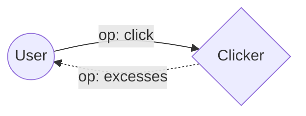
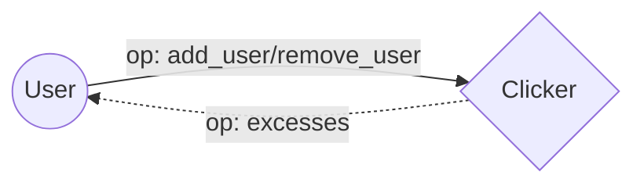
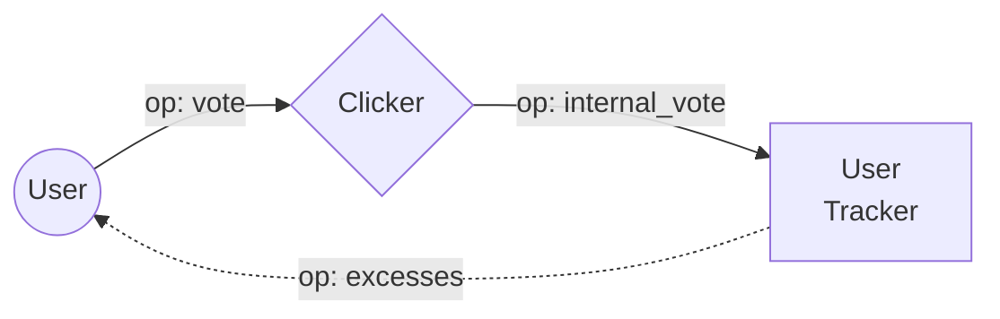
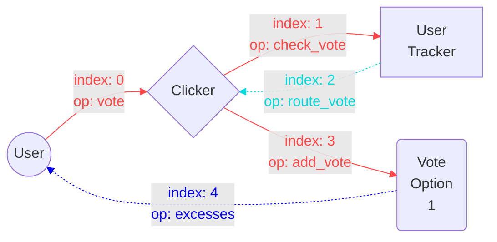
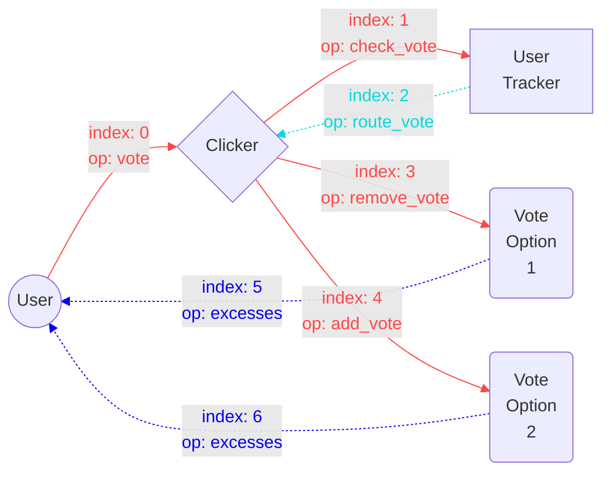

# TON blockchain tasks

## Task 1

Develop a smart contract `Clicker` that counts how many times it was called

### Purpose

Purpose of this task is to familiarize yourself with how TON blockchain works, how to develop simple smart contracts and how to send transactions to blockchain itself

### Requirements

- `Clicker` should only accept a call with a special op `click` by anyone
- `Clicker` should keep the number of calls on storage
- the user should receive excess TON after operation completes

### Message chain

## Task 2

Develop a smart contract `Clicker` that counts how many times it was called by each individual user

### Purpose

Purpose of this task is to understand parent-child contract interaction 

### Requirements

- `Clicker` should only accept a call with a special op `click` by anyone
- the number of calls by each user should be tracked by a child contract `Tracker` for each user
- the `Clicker` should deploy `Tracker` contracts for each user on demand
- `Tracker` should only accept messages from `Clicker`
- the user should receive excess TON after operation completes

### Message chain

## Task 3

Develop a smart contract `Clicker` that counts how many times it was called by a number of select users only

### Purpose

Purpose of this task is to familiarize yourself with how dictionaries work

### Requirements

- `click` op should be callable by a list of `allowed_addresses`
- `Clicker` should have a special `admin_address` address that is allowed to add and remove users from `allowed_addresses` dict
- `admin_address` is not included in `allowed_addresses` by default
- `Clicker` should keep the number of calls on storage
- the user should receive excess TON after operation completes

### Message chain

#### click op

#### add_user/remove_user op

## Task 4

Develop a smart contract `Clicker` that counts how many votes we given for a list of options

### Purpose

Purpose of this task is to further familiarize yourself with parent-child contract interaction, how to verify the call came from a child contract, how payloads work

### Requirements

- `Clicker` should only accept a call with a special op `vote` by anyone
- the user sends `vote_id` as payload on `vote` op
- `Clicker` should keep in storage a dictionary with `vote_id -> number_of_votes`
- `Tracker` should keeps track for what option the user gave their vote
- the user can change their vote after it was given
- the user should receive excess TON after operation completes

### Message chain

## Task 5

Develop a smart contract `Clicker` that counts how many votes we given for a list of options without using votes dictionary

### Purpose

Purpose of this task is to familiarize yourself a more complicated parent-child contract interaction with multiple contracts

### Requirements

- `Clicker` should only accept a call with a special op `vote` by anyone
- the user sends `vote_id` as payload on `vote` op
- how many votes were given for each option should be tracked on a `Vote_Option` contract
- `Tracker` should keeps track for what option the user gave their vote
- the user can change their vote after it was given
- the user should receive excess TON after operation completes

### Message chain

These schemes are one of the possible solutions (other solutions are possible)

#### initial vote

#### change vote

