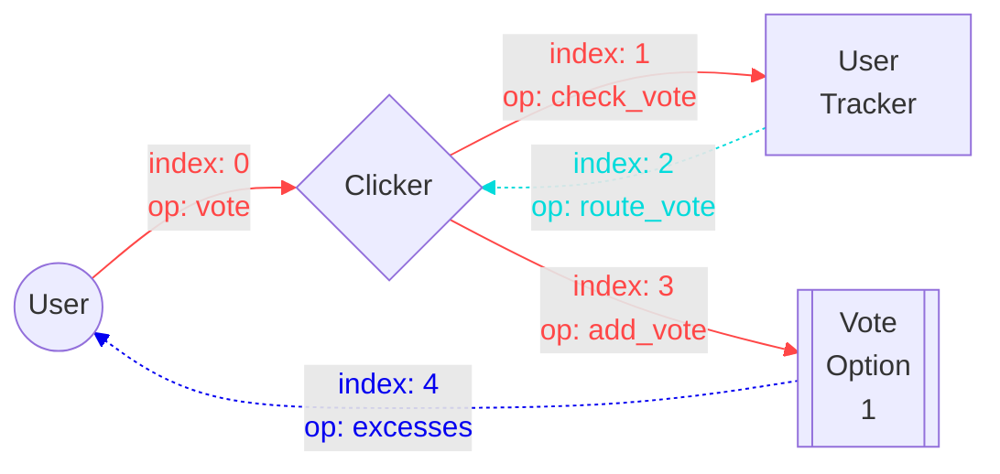
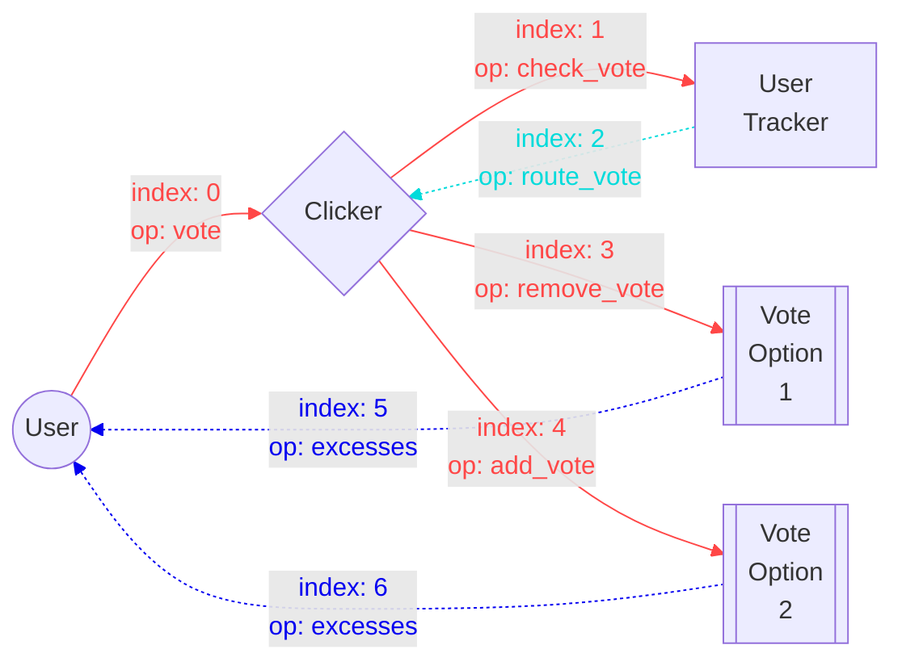

# Ton blockchain tasks

## Task 1

Develop a smart contract `Clicker` that counts how many times it was called

### Purpose

Purpose of this task is to familiarize yourself with how TON blockchain works, how to develop simple smart contracts and how to send transactions to blockchain itself

### Requirements

- `Clicker` should only accept a call with a special op `click` by anyone
- `Clicker` should keep the number of calls on storage
- the user should receive excess TON after operation completes

### Message chain


## Task 2

Develop a smart contract `Clicker` that counts how many times it was called by each individual user

### Purpose

Purpose of this task is to understand parent-child contract interaction 

### Requirements

- `Clicker` should only accept a call with a special op `click` by anyone
- the number of calls by each user should be tracked by a child contract `Tracker` for each user
- the `Clicker` should deploy `Tracker` contracts for each user on demand
- `Tracker` should only accept messages from `Clicker`
- the user should receive excess TON after operation completes

### Message chain


## Task 3

Develop a smart contract `Clicker` that counts how many times it was called by a number of select users only

### Purpose

Purpose of this task is to familiarize yourself with how dictionaries work

### Requirements

- `click` op should be callable by a list of `allowed_addresses`
- `Clicker` should have a special `admin_address` address that is allowed to add and remove users from `allowed_addresses` dict
- `admin_address` is not included in `allowed_addresses` by default
- `Clicker` should keep the number of calls on storage
- the user should receive excess TON after operation completes

### Message chain

#### click op


#### add_user/remove_user op


## Task 4

Develop a smart contract `Clicker` that counts how many votes we given for a list of options

### Purpose

Purpose of this task is to further familiarize yourself with parent-child contract interaction, how to verify the call came from a child contract, how payloads work

### Requirements

- `Clicker` should only accept a call with a special op `vote` by anyone
- the user sends `vote_id` as payload on `vote` op
- `Clicker` should keep in storage a dictionary with `vote_id -> number_of_votes`
- `Tracker` should keeps track for what option the user gave their vote
- the user can change their vote after it was given
- the user should receive excess TON after operation completes

### Message chain


## Task 5

Develop a smart contract `Clicker` that counts how many votes we given for a list of options without using votes dictionary

### Purpose

Purpose of this task is to familiarize yourself a more complicated parent-child contract interaction with multiple contracts

### Requirements

- `Clicker` should only accept a call with a special op `vote` by anyone
- the user sends `vote_id` as payload on `vote` op
- how many votes were given for each option should be tracked on a `Vote_Option` contract
- `Tracker` should keeps track for what option the user gave their vote
- the user can change their vote after it was given
- the user should receive excess TON after operation completes

### Message chain

These schemes are one of the possible solutions (other solutions are possible)

#### initial vote



#### change vote



## Materials

- [getting started](https://docs.ton.org/develop/smart-contracts/sdk/javascript)
- FunC [std lib](https://docs.ton.org/develop/func/stdlib)
- FunC [specification](https://docs.ton.org/develop/func/types)
- FunC [cookbook](https://docs.ton.org/develop/func/cookbook)
- FunC [send mods](https://docs.ton.org/develop/smart-contracts/messages#message-modes)
- [FunC lessons](https://github.com/romanovichim/TonFunClessons_Eng/tree/main/lessons/smartcontract)
- [some youtube lessons](https://www.youtube.com/watch?v=isfFGmyJvns&list=PLyDBPwv9EPsA5vcUM2vzjQOomf264IdUZ)

## Notes

### General

- install `Nodejs >= 18`
- you should familiarize yourself with `git` (you can use GitHub app or VsCode extension for repo management)
- you should publish your tasks on `GitHub`
- you should try using wallets from mnemonic, browser extension and tonkeeper mobile
- you can use testnet to deploy your contracts
- use this telegram bot to get testnet TON: https://t.me/testgiver_ton_bot

### Contracts

- you should always check if there's enough TON sent in a transaction to complete the whole message chain
- you should use [`@ston-fi/funcbox`](https://www.npmjs.com/package/@ston-fi/funcbox) for std FunC functions
- you should use [`@ton/blueprint`](https://www.npmjs.com/package/@ton/blueprint) for development environment
- you should test all you project's functionality in local sandbox
- you should create cli scripts to interact with contracts on-chain

### VsCode

- install this extension for intellisense: `VisualStudioExptTeam.vscodeintellicode`
- install this extension for packages intellisense: `christian-kohler.npm-intellisense`
- install this extension for FunC language support: `tonwhales.func-vscode`
- install this extension for markdown support: `yzhang.markdown-all-in-one`
- install this extension for mermaid graph support: `bierner.markdown-mermaid`
- install this extension to check your spelling: `streetsidesoftware.code-spell-checker`
- install this extension for better icons in a file tree: `vscode-icons-team.vscode-icons`
- press `Ctrl + /` to toggle comments in code

## Contract template

You can use [this template](https://github.com/sikvelsigma/ton-template) to start your projects or create basic project template with `npm create ton@latest` command

## Tips 

### Sending msgs

There're several functions to send msgs in `@ston-fi/funcbox`, you can find them in `node_modules/@ston-fi/funcbox/contracts/msgs.fc`

Msgs are sent using different [send modes](https://docs.ton.org/develop/smart-contracts/messages#message-modes) (some of them can be combined):

  - `NORMAL` (0)
  - `PAID_EXTERNALLY` (1)
  - `IGNORE_ERRORS` (2)
  - `BOUNCE_IF_FAIL` (16)
  - `DESTROY_IF_ZERO` (32)
  - `CARRY_REMAINING_GAS` (64)
  - `CARRY_ALL_BALANCE` (128)

Some of them can be combined with a bitwise `or` operation (`|`) since each bit represents a mode:

```func
int mode = CARRY_ALL_BALANCE | IGNORE_ERRORS; 	;; this is valid send_mode that will carry all balance (if no reserve command) and won't throw error on failure
```

### Working with dictionary

You can use dict utils from `@ston-fi/funcbox` at `node_modules/@ston-fi/funcbox/contracts/dict.fc` but they are pretty complex.

You can start by using functions from [stdlib](https://docs.ton.org/develop/func/stdlib#dictionaries-primitives)

### Using address as dictionary key

In order to use address as key in dictionary we need to use its 256-bit hashpart. [More about addresses](https://docs.ton.org/learn/overviews/addresses)

```func
...
	slice account = in_msg_body~load_msg_addr();	;; read incoming address from msg

	;; the value in dict is slice, so if you want to put an actual number here you need to create a slice with it
	storage::accounts~udict_set(256, account.address::get_hashpart(), empty_slice());
...
```

In the wrapper in order to parse dict into a readable map of addresses you can use this snippet

```ts
import { parseDict } from "@ton/core/dist/dict/parseDict";
...
 	let accountsRaw = result.stack.readCellOpt()	// read raw cell from contract getter
	const addressList: Address[] = []

	if (accountsRaw !== null) {
		const addrMap = parseDict(accountsRaw.beginParse(), 256, (slice) => {
			// here we should parse slice that contains data for each entry for each dict
			// but our slice is empty so we just return 0
			return 0
		});
		for (let k of addrMap.keys()) {
			// create address from hashpart
			addressList.push(rawNumberToAddress(k))
		}

	}
...
```

### Working with child contracts

#### Create function that returns init storage 

This function depends on the `user_address` and since contract address depends on contract code and `state_init` each user will have a unique `Tracker` contract

```func
(cell) tracker_ctr(slice _user_address, slice _clicker_address) inline {
    return begin_cell()
        .store_slice(_user_address) 		;; address of the user that is tracked
        .store_slice(_clicker_address)		;; parent contract
        .store_uint32(0) 					;; id of vote_option
    .end_cell();
}
```
#### Send msg to child contract with `state_init`

```func
...
	var tracker = contracts::from_sources(
		tracker_ctr(ctx.at(SENDER), my_address()),
		storage::tracker_code
	);

	var msg = begin_message(internal_vote)
		.store_uint(vote_id, 32)
		.end_cell();

	msgs::send_with_stateinit(
		0, 										;; ton value (in addition to whatever send_mode you're using)
		tracker~address(params::workchain), 	;; child ctr address
		tracker~state_init(), 					;; contract state_init
		msg, 									;; msg cell
		CARRY_REMAINING_GAS						;; send mode
	);

...
```

#### Verify a call came from child contract

In order to verify a call came from a child contract you need to construct the same `tracker` using incoming data and check this condition:

```func
...
	slice user_address = in_msg_body~load_msg_addr();  ;; read user address from incoming msg since it defines state_init

	var tracker = contracts::from_sources(
		tracker_ctr(user_address, my_address()),
		storage::tracker_code
	);

	;; check if the call came from the address of the tracker contract that is defined for this user
	throw_unless(error::invalid_caller, ctx.at(SENDER).equal_slices(tracker~address(params::workchain)));
...
```